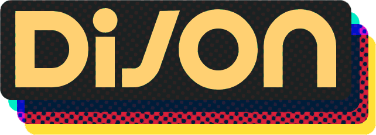

  

## Hey! I'm Dijon! 🍋

I'm a Game Developer & Modder specializing in public servers and minigames! Currently building my own  server :]

> *Note: most of my projects are under NDA or private, for a showcase of my modern work, please **contact me** for access to a showcase repo :]*

## Projects I've Worked On

-   

-   

-   

- 

- 

 
## *Make Things!* 🍋
